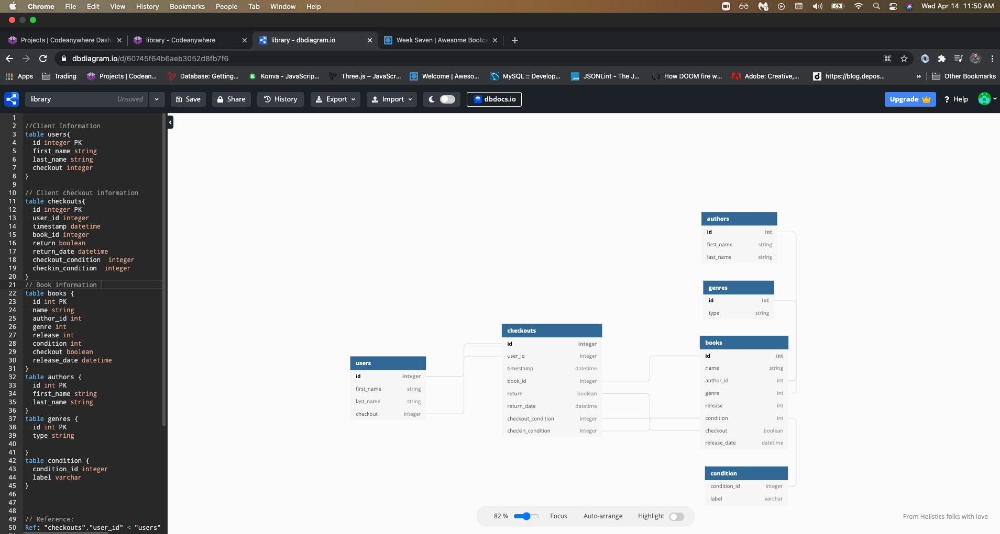
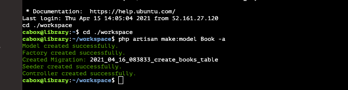
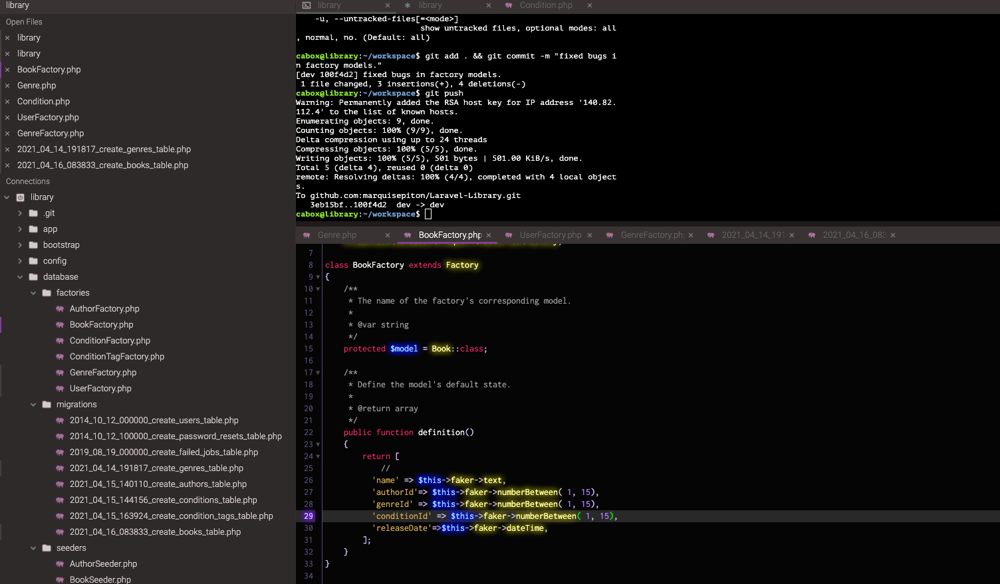
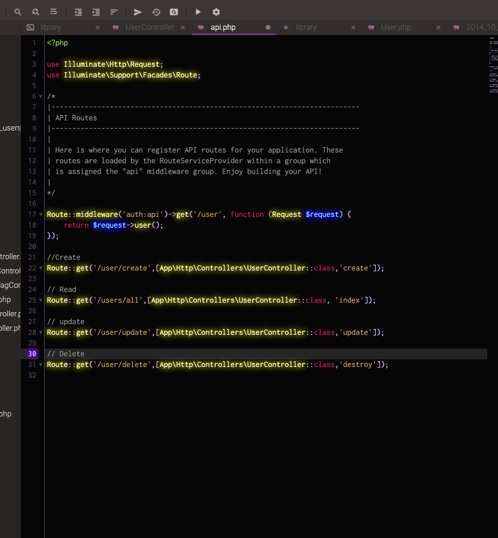
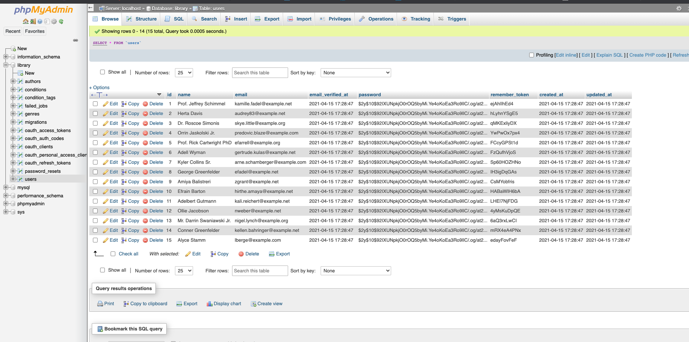
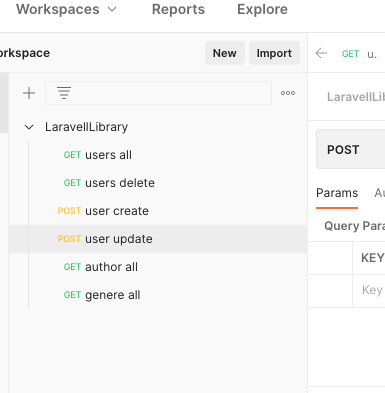

# An API for Librarians! 📕 📗 📘 📙

In this projects, I created an API for librarians to know the status of books in their library, and update books and their information.

First, I wanted psuedo code my database and think about how I wanted to structure my data. I used "DBDiagram" as my planner for this tasks. 

Tables: 

        - User
        - checkouts
        - books
        - genres
        - authors
        - chondition

Once I was happy with the data structure, I downloaded all the necessary Lavarel packages and then set up the environment using Codeanywhere. Then I went through the "vertical slice"; creating the Migration, Model, Factories, Seeder, Controller, and the route for each of the tables. 

"php artisan make:model "table_name" -a"  Makes the migration, model, factory, seeder, controller, and route file for you. 

 

Then I ran "php artisan migrate:fresh --seeder" to build the tables in the database to make sure the data was rendering.

Then I use "postman" website to be able to call the API to be able to run the "CRUD (create, read, update, delete)" functions. 

